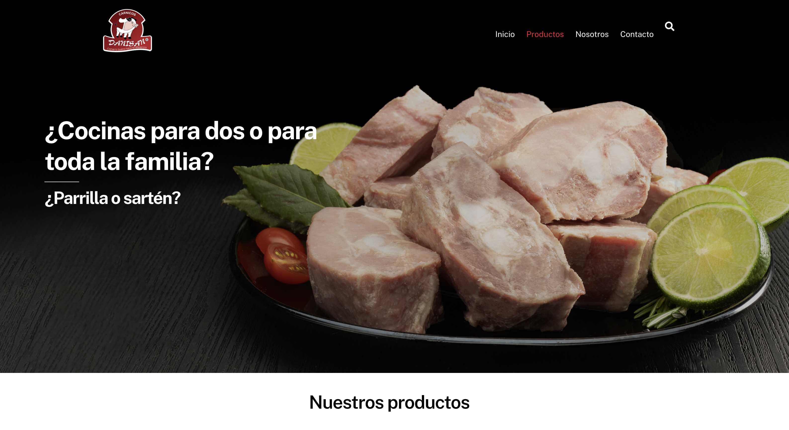
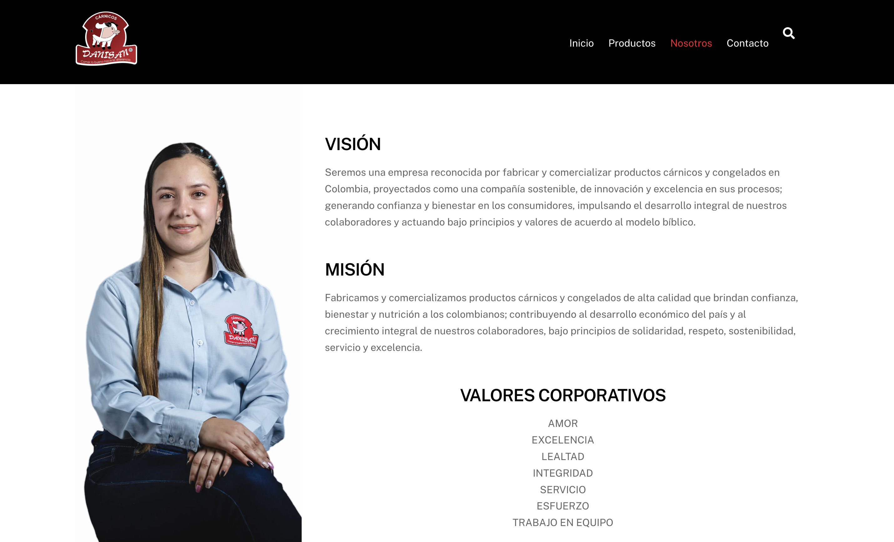
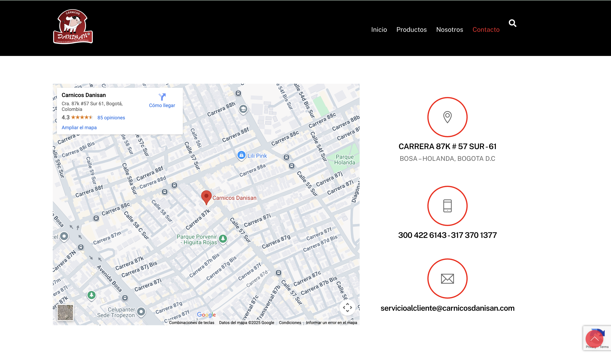
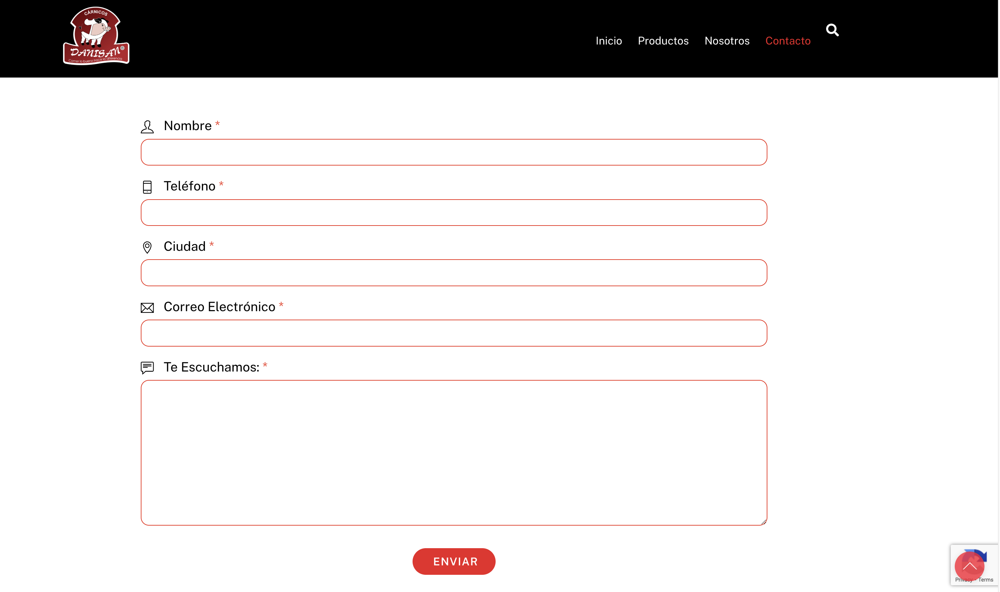
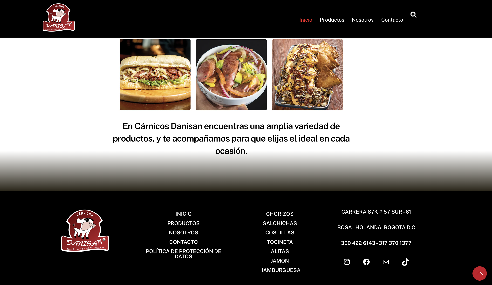
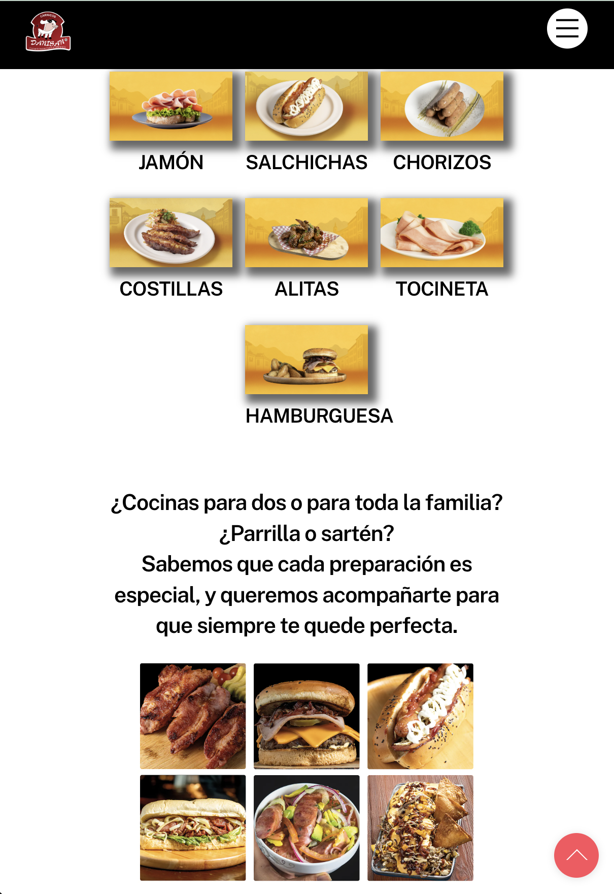

# 🥩 Carnicos Danisan Website

Professional website developed for a butcher company, focused on showcasing high-quality meat products with an optimized user experience and intuitive filtering system.

## 🎯 Project Objective

Create a professional digital presence that allows customers to explore the complete catalog of meat products, learn about the company, and establish direct communication through contact forms.

## 🛠️ Tech Stack

- **CMS:** WordPress 6.x
- **Page Builder:** Themify Builder
- **Languages:** PHP, HTML5, CSS3, JavaScript
- **Responsive Design:** Mobile-first approach
- **Plugins:** 
  - Themify Builder (visual construction)
  - Integrated Contact Form
  - Custom filtering system

---

## ✨ Key Features

### 📱 Responsive Design
- Full adaptation to mobile devices, tablets, and desktop
- Image optimization for different resolutions
- Mobile-friendly navigation

### 🔍 Filtering System
- Smart filtering by product category
- Quick and efficient search
- Dynamic category menu

### 📦 Product Catalog
- Detailed description of each product
- Packaged product images
- Cooked/prepared product images

### 🎨 Hero Banner
- Impactful main banner on homepage
- Optimized call-to-action
- Attractive visual design

---

## 📄 Website Pages

### 🏠 Home
- Main hero banner
- Featured products
- Custom widgets

### 🥩 Products
- Complete catalog
- Category filtering system
- Image gallery (packaging + prepared)
- Detailed descriptions

### 👥 About Us

- Values 
- Mission and vission 

### 📧 Contact
- Functional contact form
- Email reception and response system
- Location information
- Contact widgets

## 💻 My Technical Contribution

- **Complete site development** using WordPress and Themify Builder
- **Responsive design** adapted to all devices
- **Implementation of filtering system** by categories
- **Custom widgets configuration** on each page
- **Email system integration** for contact management
- **Image optimization** for web (packaged and cooked products)
- **Intuitive navigation structure** with category menu
- **Cross-browser testing** and performance optimization

## 🎨 Custom Widgets

Each page features specific widgets designed to enhance user experience:
- Product categories widget
- Featured products widget
- Contact information widget

## 📸 Screenshots

### 🖥️ Desktop View
- Homepage with hero banner
- Products page with filters
- Product detail page

### 📲 Mobile View

- Responsive navigation
- Mobile-optimized catalog
- Contact form

## 🔗 Link

🌐 [Live Site Link](https://www.carnicosdanisan.com/)

## 📝 Development Notes

This project demonstrates my ability to:
- Work with WordPress and professional page builders
- Create intuitive user experiences
- Implement filtering and search functionalities
- Design fully responsive websites
- Manage multimedia content (product images)
- Integrate communication systems (contact forms)

---

👨‍💻**Developed by:** [Ashley Sanchez]  
📧**Email:** ashleymsanchez05@gmail.com
💼 **GitHub:** [@ashleymichelle5](https://github.com/ashleymichelle5)
⚙️**Main Technology:** WordPress + Themify Builder  
📅**Year:** [2025]